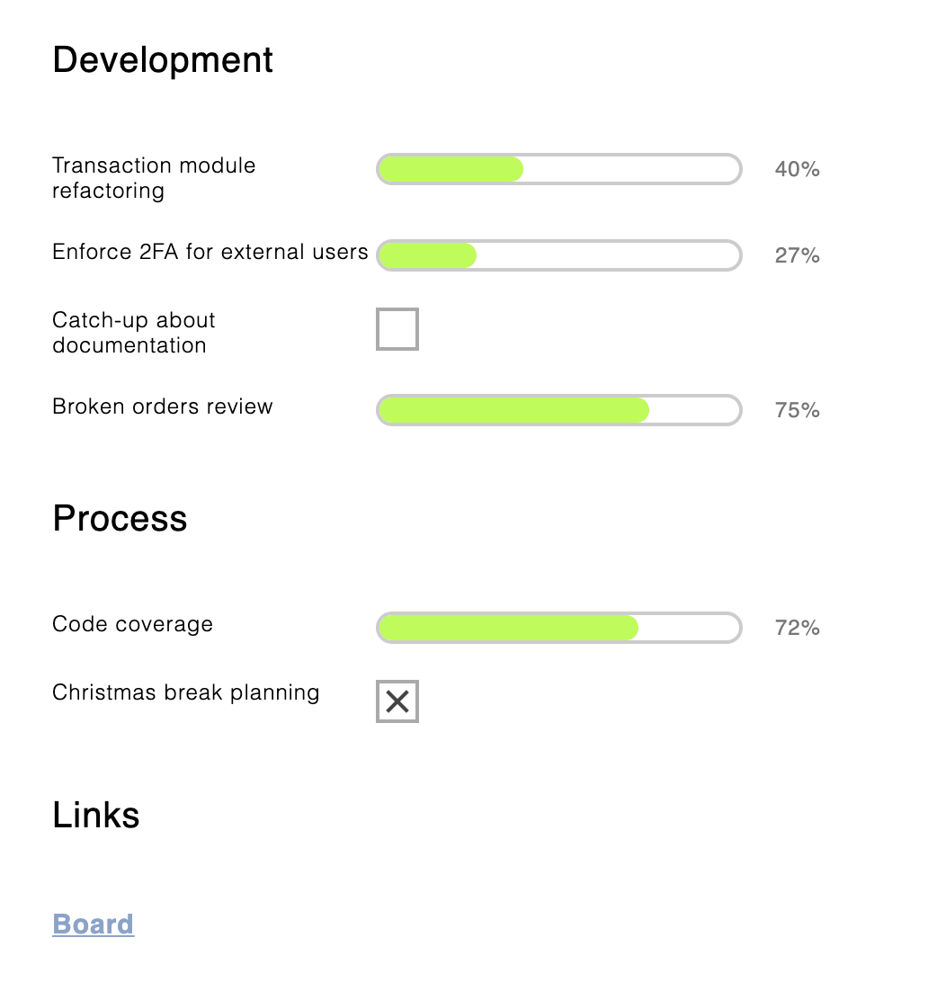

# Minimalistic and zero-code status pages

Use your favorite markdown and generate a beautiful and simple status page without any coding.

## Usage

### 1. Syntax

Write your status in plaintext as a list of items. You may optionally put a progress in square brackets or insert a link next to the text.

Example:

```md
Development

Transaction module refactoring  [2/5] 
Enforce 2FA for external users  [27%]
Catch-up about documentation    [   ]
Broken orders review            [3/4]

Process

Code coverage                   [72%]
Christmas break planning        [ x ]

Links

Board    https://google.com?s=board
```

### 2. Configuration

Add a `script` to the top of the text and save it as HTML.

```html
<script src="https://raw.githack.com/zdanowiczkonrad/status-markdown/master/status.js"></script>

Development

Transaction module refactoring [2/5] 
Enforce 2FA for external users [27%]
(rest of the text)
```

### 3. Open the file in the browser



### 4. Modification

Just change the text in the HTML and refresh the page! Magic!

## Syntax documentation

```
Work in progress
```